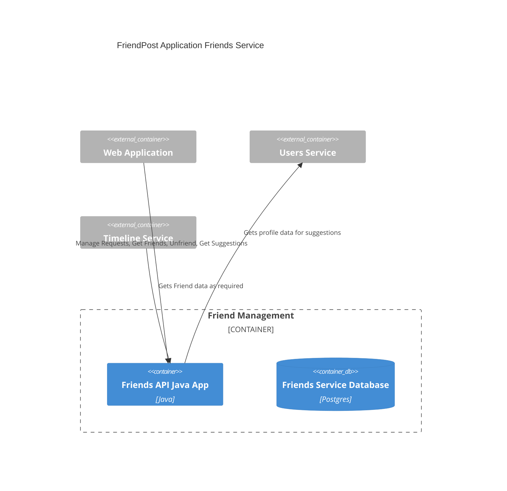

# friends-spec

This repository contains the specification for the Friends serive of the FriendPost application.

## Tech Stack

The Friends service will be implemented using Java and Postgres

## C4 Container diagram

